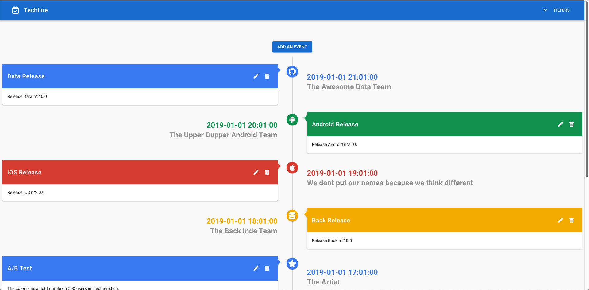

# techline
A timeline of events for tech teams

[](https://opensource.org/licenses/Apache-2.0)
[](https://github.com/pcorbel/techline/releases)
[](https://godoc.org/github.com/pcorbel/techline)


*The WebUI*

--- 

# How to setup

```
docker-compose --file deployments/docker-compose.yaml up
```

Then go to [localhost:8080](http://localhost:8080)

---

# How to edit settings

They are three files to add your own configuration to the project:

* The [deployments/docker-compose.yaml](https://github.com/pcorbel/techline/blob/master/deployments/docker-compose.yaml) to configure docker
* The [configs/config.yaml](https://github.com/pcorbel/techline/blob/master/configs/config.yaml) to change server/DB settings
* The [configs/themes.yaml](https://github.com/pcorbel/techline/blob/master/configs/themes.yaml) to add your own predefined themes which will be available from the WebUI

Exemple:
```
  - title: "Other" # Your title
    color: "#0F9D58" # Your color in hexa format
    icon: "fas fa-star" # Your icon code from Font Awesome 5
```

--- 

## Project Architecture

## Backend

### Description

The backend is based on Golang with the [echo library](https://github.com/labstack/echo) to serve as API endpoint and to serve the frontend website

### Dependencies Management

To manage dependencies, we use [go modules](https://github.com/golang/go/wiki/Modules)

To update dependencies, execute:
```go get -u && go mod tidy```

### How to run development mode

To run development mode backend, execute:
```go run cmd/*.go```

### How to lint your code

To lint your code, execute:
```go fmt ./...```

### How to build

To build backend, execute:
```go build```

---

## Frontend

### Description

The frontend is based on:
* [vuetify](https://github.com/vuetifyjs/vuetify)

### Dependencies Management

To manage dependencies, we use [npm](https://github.com/npm/cli)

To update dependencies, execute:
```npm upgrade --save```

### How to run development mode

To run development mode frontend, execute:
```npm run serve```

### How to lint your code

To lint your code, execute:
```npm run lint```

### How to build

To build frontend, execute:
```npm run build```

---

## Storage

The storage is based on:
* [Postgres](https://github.com/postgres/postgres) to store data
* [gorm](https://github.com/jinzhu/gorm) to serve as an interface between backend and storage

---

# Generate dummy data

```
curl -X POST http://localhost:8080/api/v1/events \
-H "Content-Type: application/json" \
-d '{
    "title":"Data Release",
    "color":"#4285F4",
    "icon":"fab fa-github",
    "message":"Release Data n°2.0.0",
    "author":"The Awesome Data Team",
    "created_at":"2019-01-01T20:00:00.000Z"
}'

curl -X POST http://localhost:8080/api/v1/events \
-H "Content-Type: application/json" \
-d '{
    "title":"Android Release",
    "color":"#0F9D58",
    "icon":"fab fa-android",
    "message":"Release Android n°2.0.0",
    "author":"The Upper Dupper Android Team",
    "created_at":"2019-01-01T19:00:00.000Z"
}'

curl -X POST http://localhost:8080/api/v1/events \
-H "Content-Type: application/json" \
-d '{
    "title":"iOS Release",
    "color":"#DB4437",
    "icon":"fab fa-apple",
    "message":"Release iOS n°2.0.0",
    "author":"We dont put our names because we think different",
    "created_at":"2019-01-01T18:00:00.000Z"
}'

curl -X POST http://localhost:8080/api/v1/events \
-H "Content-Type: application/json" \
-d '{
    "title":"Back Release",
    "color":"#F4B400",
    "icon":"fas fa-database",
    "message":"Release Back n°2.0.0",
    "author":"The Back Inde Team",
    "created_at":"2019-01-01T17:00:00.000Z"
}'

curl -X POST http://localhost:8080/api/v1/events \
-H "Content-Type: application/json" \
-d '{
    "title":"A/B Test",
    "color":"#4285F4",
    "icon":"fas fa-star",
    "message":"The color is now light purple on 500 users in Liechtenstein.\nLets make some analytics on it 🤓",
    "author":"The Artist",
    "created_at":"2019-01-01T16:00:00.000Z"
}'

curl -X POST http://localhost:8080/api/v1/events \
-H "Content-Type: application/json" \
-d '{
    "title":"Other",
    "color":"#0F9D58",
    "icon":"fas fa-star",
    "message":"I ate an apple 👍",
    "author":"Someone",
    "created_at":"2019-01-01T15:00:00.000Z"
}'

curl -X POST http://localhost:8080/api/v1/events \
-H "Content-Type: application/json" \
-d '{
    "title":"Manual Operation",
    "color":"#F4B400",
    "icon":"fas fa-hand-paper",
    "message":"Platform has been restarted",
    "author":"The on call dude",
    "created_at":"2019-01-01T14:00:00.000Z"
}'

curl -X POST http://localhost:8080/api/v1/events \
-H "Content-Type: application/json" \
-d '{
    "title":"Incident",
    "color":"#DB4437",
    "icon":"fas fa-bug",
    "message":"The platform crashed",
    "author":"The stagioss",
    "created_at":"2019-01-01T13:00:00.000Z"
}'
```
